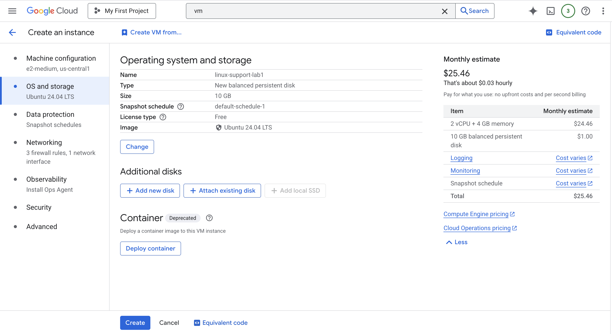
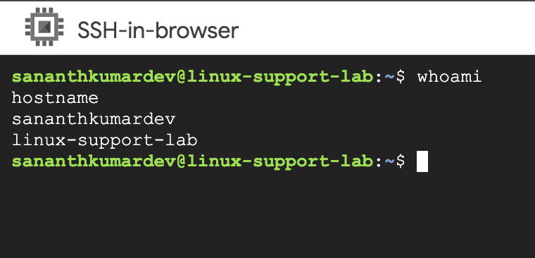
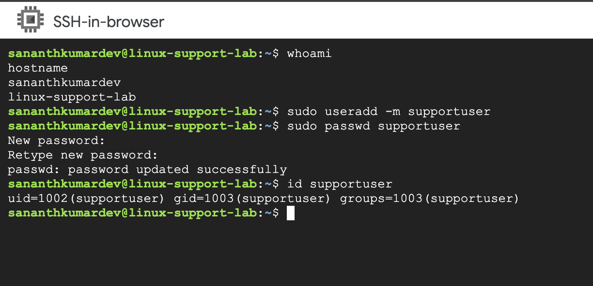
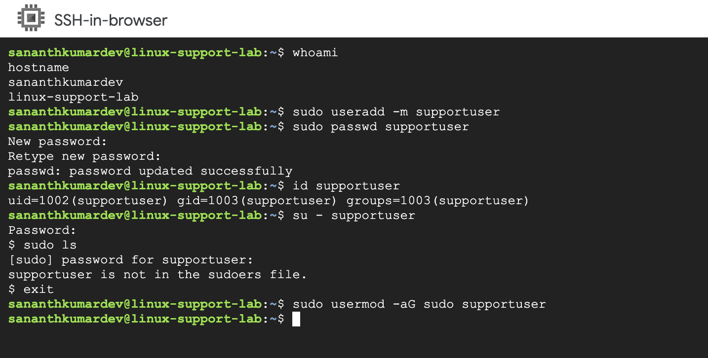
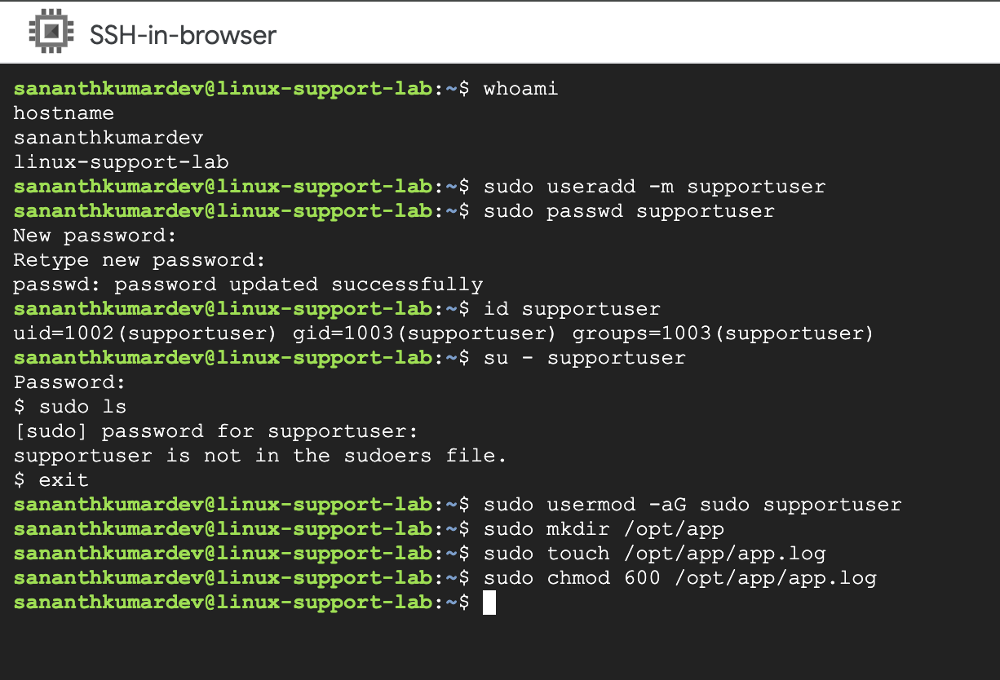
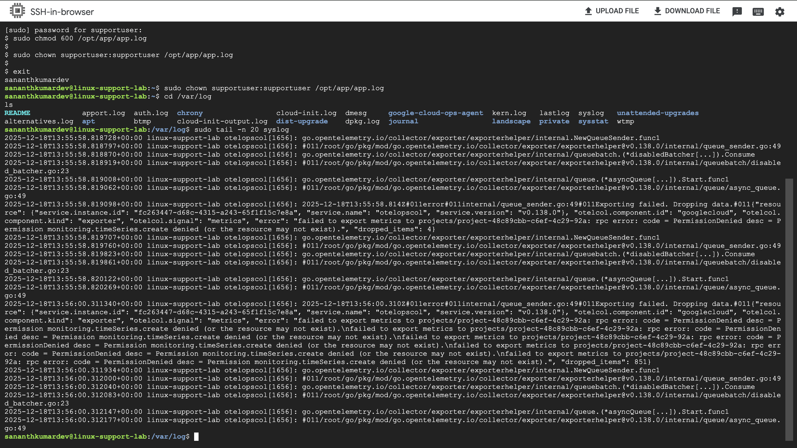
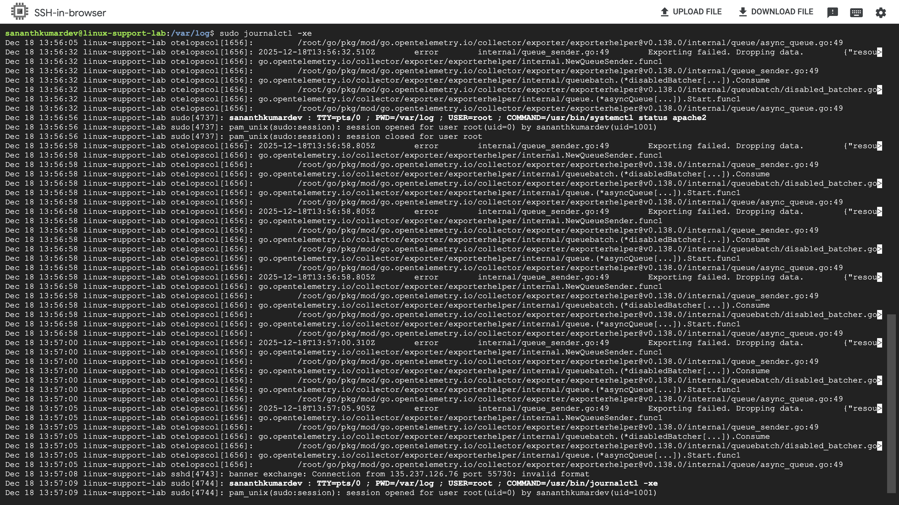

# Linux Support Lab (GCP)

## Project Overview
This project is a hands-on Linux support lab created on Google Cloud Platform (GCP).
The objective of this lab is to simulate real-world Linux L1/L2 support activities such as
user management, permission issues, and log troubleshooting on an Ubuntu server.

This project reflects how Linux support engineers work in real production environments.

---

## Environment Details
- Cloud Provider: Google Cloud Platform (GCP)
- Operating System: Ubuntu 24.04 LTS
- Access Method: SSH (Browser-based)
- Role Simulated: Linux Support Engineer (L1/L2)

---

## Scenario 1: Virtual Machine Creation on GCP
A Linux virtual machine was created on Google Cloud Platform using the Ubuntu 24.04 LTS image.
This VM acts as a production-like Linux server for support operations.

Real-life scenario:
In companies, Linux servers are hosted on cloud platforms such as GCP, AWS, or Azure.

Screenshot:


---

## Scenario 2: SSH Login and Server Verification
Connected to the Linux VM using SSH and verified the logged-in user and hostname.

Commands used:
```bash
whoami
hostname
```

Real-life scenario:
Support engineers always confirm the server identity before performing administrative tasks.

Screenshot:


---

## Scenario 3: User Creation (Employee Onboarding)
Created a new Linux user account to simulate onboarding of a new employee.

Commands used:
```bash
sudo useradd -m supportuser
sudo passwd supportuser
id supportuser
```

Real-life scenario:
IT support teams create Linux accounts for new employees who require system access.

Screenshot:


---

## Scenario 4: Sudo Permission Error
Switched to the newly created user and attempted to execute administrative commands.
The user did not have sudo privileges, resulting in a permission error.

Command used:
```bash
sudo ls
```

Error observed:
supportuser is not in the sudoers file

Real-life scenario:
This is a common support ticket when users are created without admin privileges.

Screenshot:


---

## Scenario 5: Fixing Sudo Permission Issue
Resolved the sudo access issue by adding the user to the sudo group.

Command used:
```bash
sudo usermod -aG sudo supportuser
```

Real-life scenario:
Administrative access is granted based on role and security policies.

Screenshot:


---

## Scenario 6: File Permission Issue
Simulated an application permission issue by creating a log file with restricted permissions.

Commands used:
```bash
sudo mkdir /opt/app
sudo touch /opt/app/app.log
sudo chmod 600 /opt/app/app.log
```

Real-life scenario:
Incorrect file permissions often cause applications to fail in production systems.

Screenshot:


---

## Scenario 7: Log Analysis and Troubleshooting
Analyzed system logs to identify errors and understand system behavior.

Commands used:
```bash
cd /var/log
sudo tail -n 20 syslog
sudo journalctl -xe
```

Real-life scenario:
Linux systems rely on logs for diagnosing and resolving issues.

Screenshot:


---

## Skills Demonstrated
- Linux user and group management
- Sudo permission troubleshooting
- File permissions and ownership
- System log analysis using /var/log and journalctl
- Cloud-based Linux administration on GCP
- Real-world IT support problem solving
